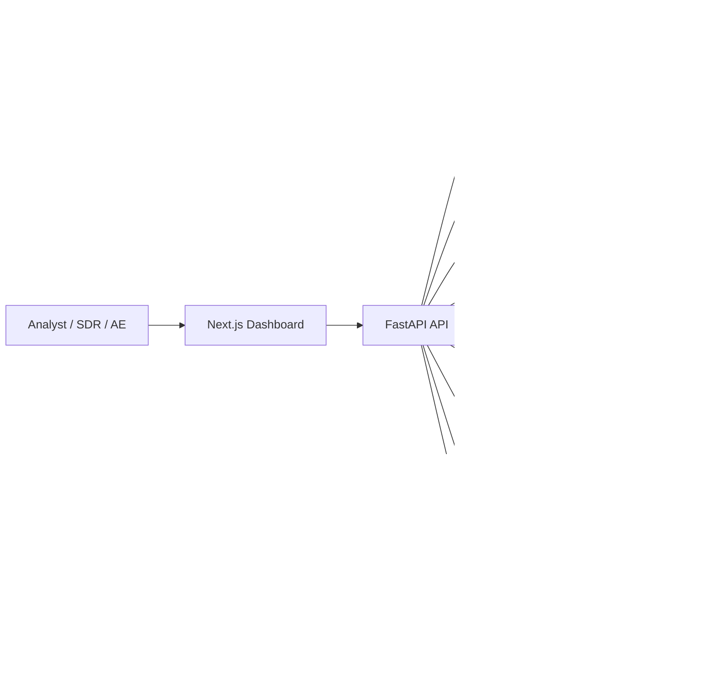
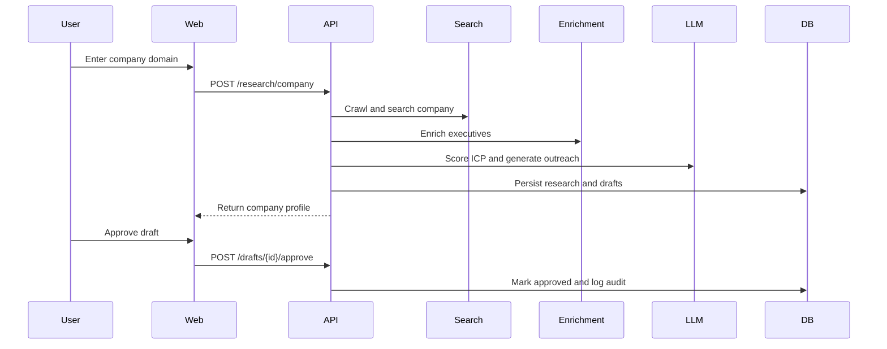
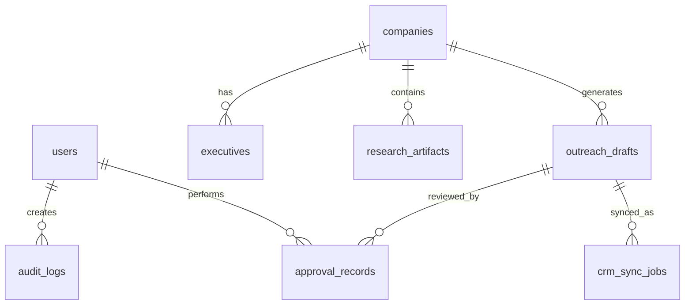

# Architecture

## System Overview

```mermaid
flowchart LR
  User[Analyst / SDR / AE] --> Web[Next.js Dashboard]
  Web --> API[FastAPI API]
  API --> PG[(PostgreSQL)]
  API --> Redis[(Redis)]
  API --> Qdrant[(Qdrant)]
  API --> LLM[OpenAI / Anthropic]
  API --> Search[Firecrawl / Tavily / Serper / Brave]
  API --> Enrich[Apollo / Hunter / PDL / Clearbit]
  API --> CRM[HubSpot / Lemlist / Salesforce]
  API --> N8N[n8n Orchestration]
```

## Sequence

```mermaid
sequenceDiagram
  participant U as User
  participant W as Web
  participant A as API
  participant S as Search
  participant E as Enrichment
  participant L as LLM
  participant D as DB

  U->>W: Enter company domain
  W->>A: POST /research/company
  A->>S: Crawl and search company
  A->>E: Enrich executives
  A->>L: Score ICP and generate outreach
  A->>D: Persist research and drafts
  A-->>W: Return company profile
  U->>W: Approve draft
  W->>A: POST /drafts/{id}/approve
  A->>D: Mark approved and log audit
```

## ER Diagram

```mermaid
erDiagram
  users ||--o{ audit_logs : creates
  users ||--o{ approval_records : performs
  companies ||--o{ executives : has
  companies ||--o{ research_artifacts : contains
  companies ||--o{ outreach_drafts : generates
  outreach_drafts ||--o{ approval_records : reviewed_by
  outreach_drafts ||--o{ crm_sync_jobs : synced_as
```