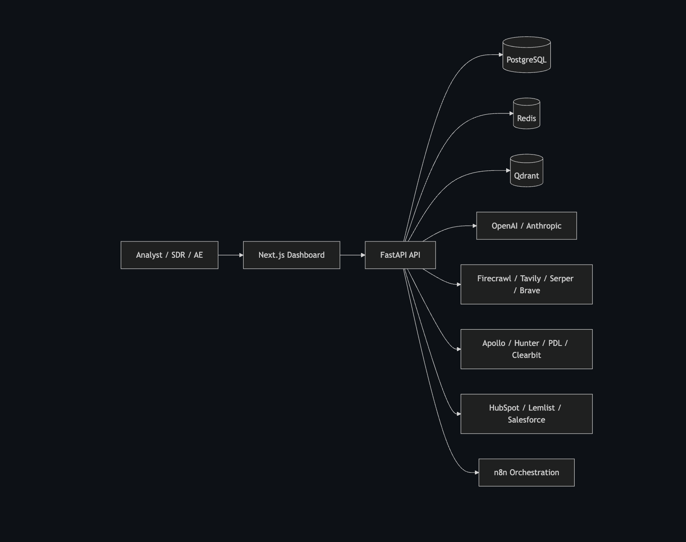

# AI Lead Enrichment Agent

An AI-powered lead research and outreach platform that turns a company domain into a qualified prospect profile, decision-maker list, buying-signal summary, and personalized outreach drafts ready for human approval.

Built for consulting portfolios, client demos, and revenue operations teams that want to show a real business workflow instead of a generic SaaS mockup.

## Professional Profile

| Professional Contact | Details |
| --- | --- |
| Name | Jawaharlal Rajan |
| Qualification | M.Tech in Artificial Intelligence and Machine Learning, BITS Pilani |
| Email | jawamtech@gmail.com |
| Core Skills | AI workflow design with LangGraph and LangChain<br>Workflow automation with n8n<br>Backend engineering with FastAPI, SQLAlchemy, Alembic, PostgreSQL, and Redis<br>LLM integration with OpenAI and Anthropic using structured outputs<br>Lead enrichment systems including ICP scoring and buying-signal analysis<br>Next.js dashboard development for review, approval, and analytics |

## Overview

This platform automates the path from raw account data to approved outreach.

It researches companies, enriches executives, scores ICP fit, identifies buying signals, generates outreach assets, and keeps a human approval step before anything is synced to a CRM.

## Business Value

- Cuts manual research time by consolidating discovery, enrichment, and qualification in one workflow
- Improves personalization with AI-generated email, LinkedIn, and call assets tailored to each account
- Adds a review gate so sales teams can approve content before it reaches a CRM or sending tool
- Gives teams one place to track account readiness, outreach drafts, and audit history

## Core Workflow

1. Enter a company domain or company name
2. Research the company and extract structured insights
3. Enrich executives and decision-makers
4. Score ICP fit and surface buying signals
5. Generate cold email sequences, LinkedIn messages, subject lines, and call scripts
6. Review and approve drafts before CRM sync

## What’s Included

- Company research and enrichment pipeline
- ICP scoring and buying-signal detection
- Outreach generation for email, LinkedIn, and calls
- Human approval and CRM sync gating
- Audit logs and sync history
- Dashboard for review, approval, and analytics

## Best For

- B2B agencies selling outbound or lead generation services
- SaaS companies building a repeatable prospecting system
- Sales teams that want AI assistance without losing control
- Independent consultants and teams who need a polished, high-value revenue operations demo

## Product Highlights

- Modular provider adapters for search, enrichment, and CRM tools
- Structured AI workflow designed for LangGraph or LangChain
- PostgreSQL for research and generated content
- Qdrant for semantic retrieval and embeddings
- Approval-first workflow for safer CRM sync
- Clean dashboard experience for fast account review

## Technology Stack

- Frontend: Next.js, React, Tailwind CSS
- Backend: FastAPI, Python, SQLAlchemy, Alembic
- AI orchestration: structured agent workflow ready for LangGraph or LangChain
- Data: PostgreSQL, Redis, Qdrant
- Automation: n8n
- Deployment: Docker, Docker Compose, GitHub Actions

## System Architecture



## Technical Docs

- [Architecture diagram](architecture.md)
- [Deployment guide](deployment.md)
- [API collection](api.http)
- [n8n workflow JSON](n8n/lead-research-workflow.json)

## Demo Flow

1. Log in with the seeded demo account
2. Enter a company domain or company name
3. Review company insights, executives, and ICP score
4. Approve the generated outreach draft
5. Sync the approved draft to CRM

## Local Setup

```bash
cp .env.example .env
docker compose up -d postgres redis qdrant
cd apps/api
python -m venv .venv
source .venv/bin/activate
pip install -r requirements.txt
alembic upgrade head
uvicorn app.main:app --reload
```

```bash
cd apps/web
npm install
npm run dev
```

## Demo Credentials

- Email: admin@acme.com
- Password: admin123!

## Notes

- External integrations are scaffolded as pluggable adapters for Firecrawl, Tavily, Serper, Brave, Apollo, Hunter.io, People Data Labs, Clearbit, HubSpot, Lemlist, OpenAI, and Anthropic.
- The implementation is modular so it can be extended into a client-specific production system without rewriting the core workflow.

